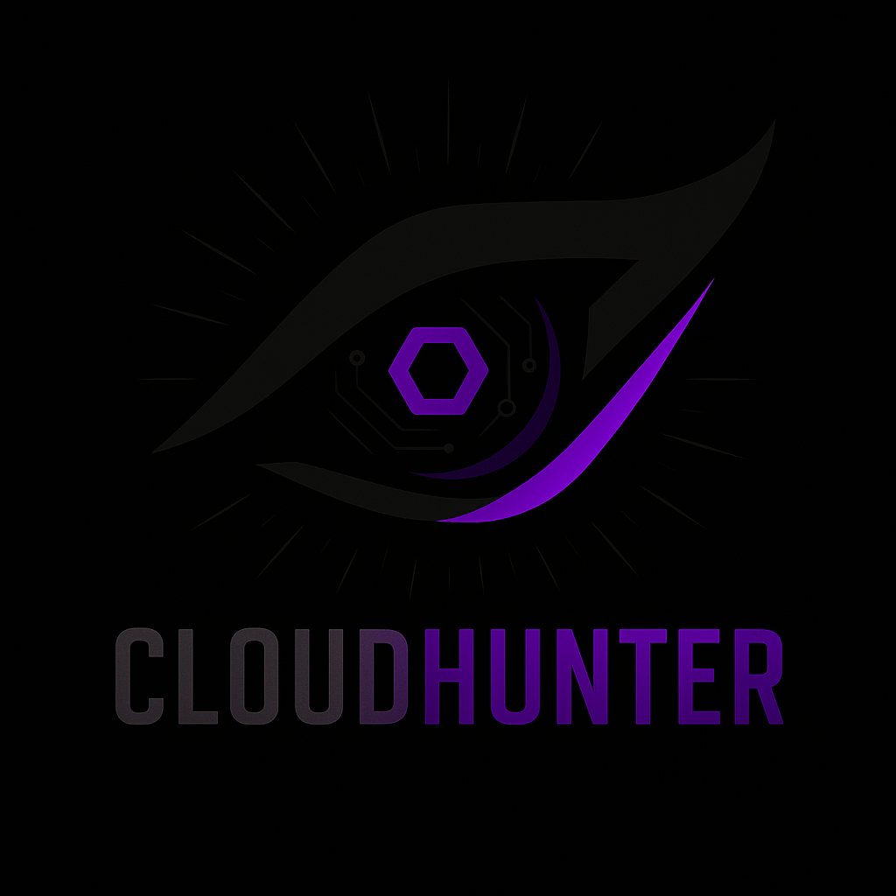

<table width="100%">
  <tr>
    <td>
      <h1>Cloudhunter — Autonomous Red Team Automation for Cloud Infrastructure</h1>
    </td>
    <td align="right" width="280">
      
    </td>
  </tr>
</table>


##  About Me & Motivation
I’m a final-year Computer Science (Cybersecurity) student, and Cloudhunter is my final-year university project. Over the past year, I’ve seen countless headlines about data stolen from the cloud — exposed S3 buckets, public blobs, and major breaches. What struck me is how often the root cause is simple: a misconfiguration left unnoticed.

I was watching Criminal Minds when an episode closed with a quote: “If you gaze long into an abyss, the abyss also gazes into you.” In that moment it hit me — attackers don’t stop. They’re always probing, always looking for the next misconfiguration or exposed bucket. Cloudhunter was born from that thought: build a tool that never stops scanning, that hunts for vulnerabilities the same way attackers do, but uses that insight to protect systems and people.

Cloudhunter started as my way of addressing that problem — building a tool that doesn’t just run static checks, but actually simulates attacker behavior to highlight what matters most before it becomes tomorrow’s headline.

---
## Design Inspiration
The name Cloudhunter and the logo are driven by the Nietzsche quote above. The eye in the logo represents vigilance and observation; the hexagon at the center symbolizes cloud infrastructure and technology. The idea of "staring into the abyss" informs the project's purpose: proactively reveal hidden risks before attackers find them.
Name: Proactively hunt cloud vulnerabilities
Logo: An eye with a tech-core (hexagon) — watchful and precise
Mission: Turn attacker mindset into a defensive advantage

---

##  Purpose
- Automate red team–style testing for AWS, Azure, and GCP.
- Identify **misconfigurations, CVEs, and compliance gaps**.
- Use **adaptive attack patterns** to show what an attacker would actually try.
- Provide **clear risk scoring and recommendations** to reduce noise and help teams focus.

---

##  Development Roadmap (Starting Oct 2025)
- Phase 1 (Oct–may 2026): CLI + AWS/Azure, CSV reports, minimal DB
- Phase 2 (future): GCP + Dashboard, FastAPI + PG, CVSS
- Phase 3 (future): Slack/Jira, Docs & OSS core

## Architecture

```mermaid
%%{init: {"theme":"dark"}}%%
flowchart LR

  %% ---------- NODES ----------
  %% Current (Phase 1)
  subgraph Client
    CLI["Cloudhunter CLI - run scans - export CSV"]
  end

  subgraph Engine["Scan Engine (current)"]
    SHARED["Shared logic - normalize - CVSS"]
    AWS["AWS connector (boto3)"]
    AZ["Azure connector (SDK)"]
  end

  subgraph Data["Data Layer (current)"]
    CSV["CSV reports"]
    PG["PostgreSQL minimal schema"]
  end

  %% Future (Phase 2/3)
  subgraph Future_Clients["Clients (future)"]
    UI["Dashboard React (future)"]
  end

  subgraph Future_API["Backend (future)"]
    APISVC["FastAPI service (future)"]
    WORKERS["Workers / containers (future)"]
  end

  subgraph Future_Cloud["Connectors (future)"]
    GCP["GCP connector (future)"]
  end

  subgraph Future_Data["Data additions (future)"]
    ES["Elasticsearch logs (future)"]
    OBJ["Object storage reports (future)"]
  end

  subgraph Integrations["Integrations (future)"]
    SLACK["Slack/MS Teams alerts (future)"]
    JIRA["Jira tickets (future)"]
  end

  %% ---------- FLOWS ----------
  %% Current flows
  CLI -->|"invoke scans"| SHARED
  CLI -->|"write reports"| CSV
  SHARED --> AWS
  SHARED --> AZ
  SHARED -->|"store metadata"| PG

  %% Future flows (dashed)
  UI -.-> APISVC
  CLI -.-> APISVC
  APISVC -.-> WORKERS
  WORKERS -.-> AWS
  WORKERS -.-> AZ
  WORKERS -.-> GCP
  WORKERS -.->|findings| PG
  WORKERS -.->|logs| ES
  WORKERS -.->|artifacts| OBJ
  APISVC -.->|alerts| SLACK
  APISVC -.->|tickets| JIRA

  %% ---------- STYLES ----------
  classDef current fill:#1e1b29,stroke:#a78bfa,color:#f5f3ff,stroke-width:1px;
  classDef future fill:#13131a,stroke:#666,color:#bbbbbb,stroke-dasharray:5 4;

  class CLI,SHARED,AWS,AZ,CSV,PG current;
  class UI,APISVC,WORKERS,GCP,ES,OBJ,SLACK,JIRA future;

  %% ---------- LEGEND ----------
  subgraph Legend["Legend"]
    L1["Current (Phase 1)"]:::current
    L2["Future (Phase 2/3)"]:::future
  end
